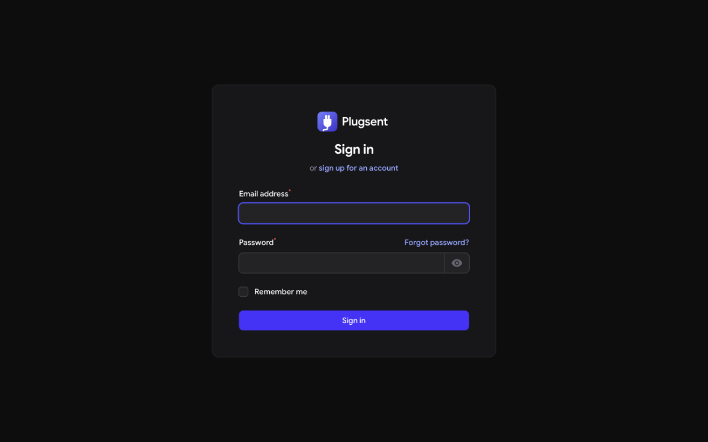
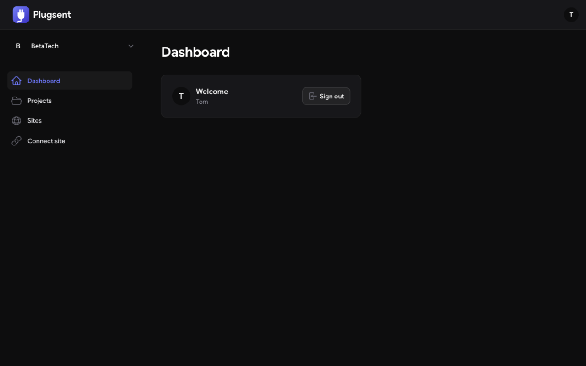

<p align="center">
  
</p>

<p align="center">
  <strong>Self-hosted, open-source fleet management for WordPress.</strong><br>
  Connect every site you run — inventory, safe updates, uptime, vulnerabilities, teams, and coding agents via MCP.
</p>

<p align="center">
  <a href="#license"></a>
  
  
  <a href="https://github.com/ashawkat/plugsent-connector"></a>
</p>

---

Plugsent is an alternative to WP Umbrella and ManageWP that **you host yourself**. Pair your
WordPress sites with a one-time code, and they check in over an outbound-only, HMAC-signed
channel — no firewall rules, no inbound ports, and never your WordPress admin password.

## Screenshots

| | |
|---|---|
|  |  |

## Features (working today)

- **Workspace-per-signup tenancy** — every signup gets an isolated workspace with slug URLs
  (`/app/betatech/…`); invite teammates with workspace and per-project roles.
- **Projects & Sites** — organize sites into projects, with workspace-scoped authorization on
  every read and write.
- **One-click pairing** — generate a 15-minute pairing code from the dashboard, paste it into
  the [connector plugin](https://github.com/ashawkat/plugsent-connector), done.
- **Live inventory** — WordPress, plugin, and theme versions with update availability, refreshed
  on every check-in.
- **Connector protocol v1** — HMAC-SHA256 signed requests, timestamp tolerance, nonce replay
  protection, instant revocation, 120 req/min throttling.
- **Revocable by design** — "Revoke access" kills the site's credentials on its next poll;
  rotation happens through the signed channel without downtime.

## Quickstart

```bash
git clone --recurse-submodules https://github.com/ashawkat/plugsent.git
cd plugsent
composer install
cp .env.example .env        # SQLite is the default local database
php artisan key:generate
php artisan migrate
php artisan serve
```

Open <http://127.0.0.1:8000/app/register>, sign up, and your workspace is created instantly.

> Prefer PostgreSQL? `docker compose up -d` starts one on :5432 — see the header of
> [docker-compose.yml](docker-compose.yml) for the `.env` lines.

### Connect a WordPress site

1. In the dashboard, open **Connect site**, fill in the site's name/URL/project, and copy the
   pairing code.
2. On the WordPress site, install the
   [Plugsent Connector](https://github.com/ashawkat/plugsent-connector) plugin and paste the
   **Server URL** + code under **Settings → Plugsent Connector**.
3. The site checks in within a minute and flips to **Connected** with its full inventory.

No WordPress site at hand? Simulate one:

```bash
php scripts/simulate-site.php http://127.0.0.1:8000 <pairing-code>
```

## Architecture

```
┌──────────────────────────────────────────────┐
│          Plugsent control plane (this repo)  │
│  Laravel 13 · Filament dashboard · REST API  │
│  uptime checker · vulnerability cache · RBAC │
│   ┌──────────────┐  ┌─────────────────────┐  │
│   │ MCP gateway  │  │  AI layer (BYO LLM) │  │
│   └──────────────┘  └─────────────────────┘  │
└──────────▲───────────────────────▲────────────┘
           │ outbound, HMAC-signed │ MCP tools
   ┌───────┴──────────┐    ┌───────┴───────────┐
   │ connector plugin │    │ coding agents     │
   │ (submodule)      │    │ Claude Code, etc. │
   └──────────────────┘    └───────────────────┘
```

- **Sites poll the server — never the reverse**, so sites behind firewalls and staging auth
  just work.
- All business logic lives in `app/Actions`; the dashboard, API, and future MCP/mobile clients
  are thin shells over the same actions.
- The full architecture, schema, and design decisions live in [PLAN.md](./PLAN.md).

## Roadmap

| Phase | Status | Scope |
|---|---|---|
| 0 — Skeleton | ✅ shipped | Laravel + Filament, tenancy, projects/sites, policies |
| 1 — Connector MVP | ✅ shipped | Pairing, signed poll loop, inventory, connect UI |
| 2 — Safe updates | planned | Restore point → one plugin at a time → smoke test → auto-rollback |
| 3 — Safety net | planned | PHP error stream, uptime + incidents, vulnerability feed |
| 4 — Teams & MCP | planned | Project-level RBAC UI, MCP gateway, consent-gated support access |
| 5 — AI | planned | Chat over your fleet, update risk summaries, weekly digests |
| 6 — Mobile | planned | PWA first, then an Expo app on the same API |

## Development

```bash
php artisan test        # 34 tests: protocol, signing, isolation, Plugin Check audit
vendor/bin/pint         # code style
```

- `packages/connector-signing` — the protocol v1 signing reference implementation.
- `plugins/plugsent-connector` — the WordPress plugin (git submodule).
- `scripts/simulate-site.php` — end-to-end connector simulator, no WordPress needed.

## Contributing

PRs are welcome! Please make sure `php artisan test` passes. The connector plugin is GPL-2.0
and follows the [WordPress Plugin Check](https://wordpress.org/plugins/plugin-check/) rules —
its static audit runs with the main suite.

## Security

Plugsent pairs sites with per-site key pairs and never stores WordPress admin passwords. If
you find a vulnerability, please use GitHub's **Report a vulnerability** (Security tab) rather
than a public issue.

## License

- The Plugsent control plane is licensed under the **MIT License** — see [LICENSE](LICENSE).
- The WordPress connector plugin is **GPL-2.0-or-later**, as WordPress plugins must be.
- [Google Sans](https://fonts.google.com/specimen/Google+Sans) is © Google, redistributed under
  the [SIL Open Font License 1.1](https://openfontlicense.org).

## Acknowledgements

Built on Laravel & Filament. Inspired by the workflows of MainWP, ManageWP, and WP Umbrella —
with the parts they keep behind a paywall, opened up.
