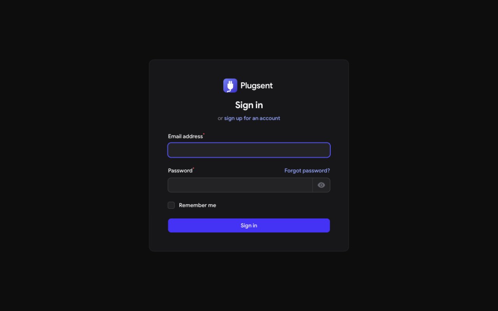
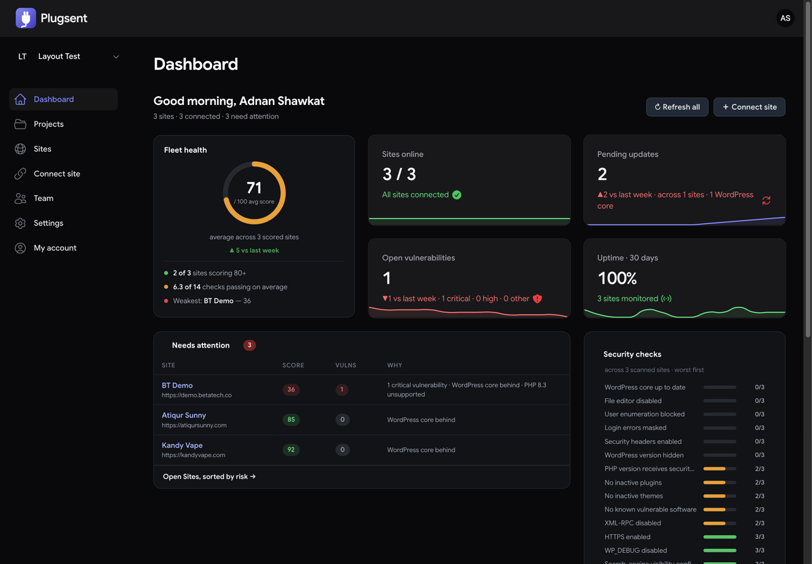
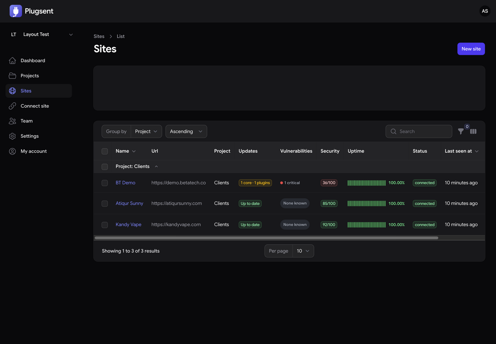
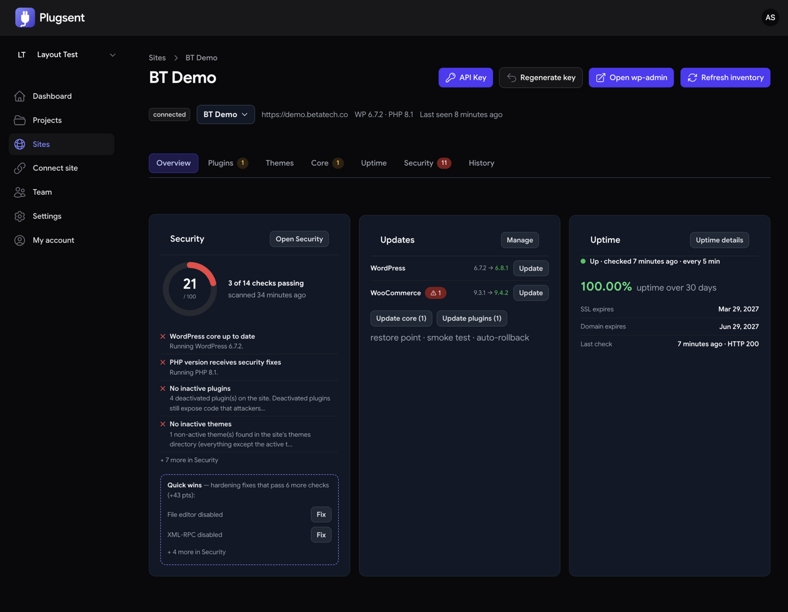
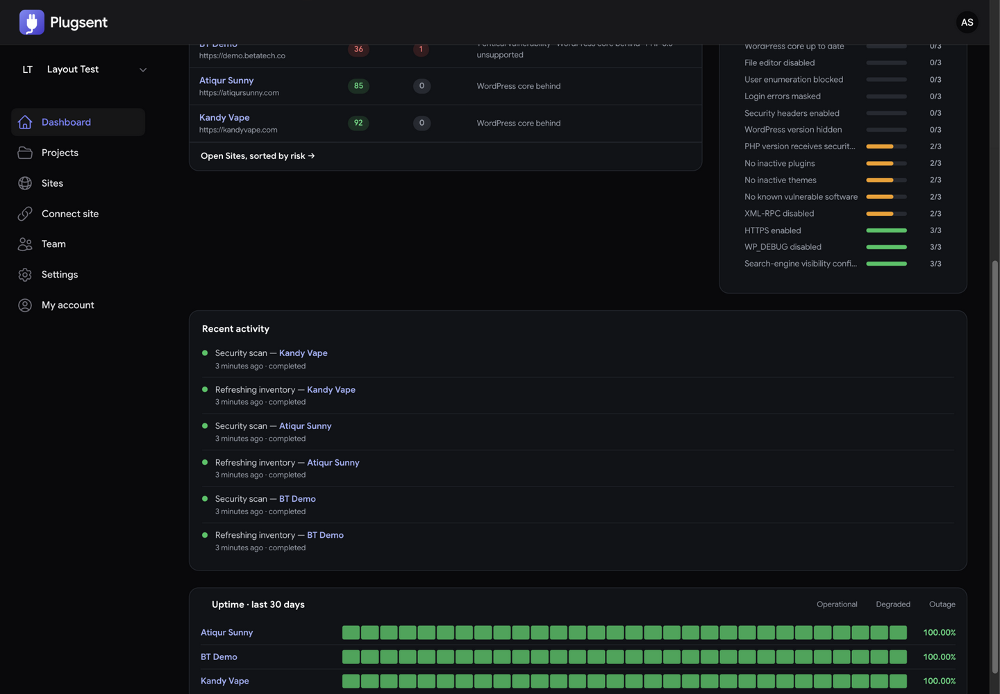

<p align="center">
  
</p>

<p align="center">
  <strong>Self-hosted, open-source fleet management for WordPress.</strong><br>
  Connect every site you run — inventory, safe updates, uptime, vulnerabilities, teams, and coding agents via MCP.
</p>

<p align="center">
  <a href="#license"></a>
  
  
  <a href="https://github.com/ashawkat/plugsent-connector"></a>
</p>

---

Plugsent is an alternative to WP Umbrella and ManageWP that **you host yourself**. Pair your
WordPress sites with a one-time code, and they check in over an outbound-only, HMAC-signed
channel — no firewall rules, no inbound ports, and never your WordPress admin password.

## Screenshots

| | |
|---|---|
|  |  |
|  |  |
|  | |

## What's new

Recent releases, newest first. The [Features](#features-working-today) section below is the
full, current list.

**October 2026 — autopilot, control & trust**

- **Self-installing scheduler** — fresh installs set up their own cron on the first site
  check-in; `plugsent:ensure-scheduler` for everything else.
- **Hourly inventory refresh & post-update verification** — pending-update lists stay honest,
  and a connector's "success" is confirmed against a fresh scan before the dashboard believes it.
- **Fast or safe updates, per site** — safe mode (default) runs restore point → smoke test →
  automatic rollback; fast mode applies directly when speed matters. Agents choose per call
  over MCP.
- **Offline detection & honest progress** — unreachable sites read "unreachable · last seen …"
  instead of "connected", and the update panel shows a real progress bar that explains stalls
  instead of freezing.
- **Read-only MCP tokens by default** — agents can inspect without mutating, and every
  agent-queued command is stamped "via MCP" with the account and token name in the site's History.
- **One updates email a day** — a single digest at a time you pick in Settings; no per-update
  spam, per-user opt-outs respected.
- **Connector downloads in the dashboard** — the pairing flow offers the latest connector ZIP
  straight from your repo's releases.
- **Self-healing admin login** — the magic-link redirect retries itself and always offers a
  manual fallback.
- **MCP gateway** — five policy-scoped tools for chat clients and coding agents (see below).
- **Branded everything** — every email shares the Plugsent layout in self-hosted Google Sans.

**September 2026 — the WP Umbrella-class feature set**

- **Fleet dashboard** — workspace score ring, KPI trend cards, needs-attention ranking,
  security-check pass rates, activity feed, per-site uptime strips.
- **Security & hardening** — 14-check score with one-click fixes and six connector-enforced
  hardening toggles.
- **Vulnerability intelligence** — local Wordfence feed mirror matched against every site,
  with per-vulnerability detail popups.
- **Site tabs & audit trail** — Overview / Plugins / Themes / Core / Uptime / Security /
  History, with a cross-site quick-switcher.
- **Uptime monitoring** — 5-minute checks, RDAP domain expiry, served-certificate SSL expiry,
  30-day rates, incident timeline.
- **Safe updates pipeline** — restore point → update → smoke test → automatic rollback, plus
  manual restore.
- **Teams & accounts** — invitations with per-project roles, SMTP settings UI, TOTP 2FA with
  recovery codes, per-user email opt-outs.

## Features (working today)

- **Workspace-per-signup tenancy** — every signup gets an isolated workspace with slug URLs
  (`/app/betatech/…`); invite teammates with workspace and per-project roles.
- **Projects & Sites** — organize sites into projects, with workspace-scoped authorization on
  every read and write.
- **One-click pairing** — generate a 15-minute pairing code from the dashboard, paste it into
  the [connector plugin](https://github.com/ashawkat/plugsent-connector), done.
- **Live inventory** — WordPress, plugin, and theme versions with update availability,
  refreshed on every check-in and re-scanned hourly across all connected sites.
- **Safe & fast updates** — safe mode (default): restore point (files + streamed database
  dump) → update → smoke test → automatic rollback, with post-update verification against a
  fresh scan. Fast mode per site (or per MCP call) skips the pipeline for speed. Core updates
  stay plain; old connectors keep the classic update path.
- **Plugin/theme actions** — activate, deactivate, delete, theme switching, update exclusions,
  manual restore — with capability-based UI (old connectors simply don't show new buttons).
- **Uptime monitoring** — scheduled external checks, downtime incidents, email alerts, a
  pause/resume toggle per site, domain & SSL expiry tracking, and a 30-day uptime-rate view.
- **Security & hardening** — Wordfence vulnerability matching with per-vulnerability detail
  popups, a 14-check security score, and six connector-enforced hardening toggles per site.
- **Emails & accounts** — branded templates (Google Sans) for uptime/security/update
  emails with per-user opt-outs; a My account page (profile, password change, 2FA setup);
  TOTP two-factor login with recovery codes; show/hide toggles on all password fields.
- **Self-healing scheduler** — hourly scans, digests, and feed syncs run on the Laravel
  scheduler, and the app installs its own `schedule:run` cron entry when it notices the
  scheduler is missing (or run `php artisan plugsent:ensure-scheduler` yourself).
- **Offline detection & honest progress** — unreachable sites read as "unreachable", queueing
  warns you, and the update panel shows a live progress bar with a plain-language explanation
  when nothing is moving.
- **Connector protocol v1** — HMAC-SHA256 signed requests, timestamp tolerance, nonce replay
  protection, instant revocation, 120 req/min throttling.
- **Revocable by design** — "Revoke access" kills the site's credentials on its next poll;
  rotation happens through the signed channel without downtime.
- **MCP gateway** — chat clients and coding agents read site stats, trigger inventory
  rescans, and queue updates through `laravel/mcp` with Sanctum bearer tokens
  (My account → MCP access).

## Quickstart

```bash
git clone --recurse-submodules https://github.com/ashawkat/plugsent.git
cd plugsent
composer install
cp .env.example .env        # SQLite is the default local database
php artisan key:generate
php artisan migrate
php artisan serve
```

Open <http://127.0.0.1:8000/app/register>, sign up, and your workspace is created instantly.

> Prefer PostgreSQL? `docker compose up -d` starts one on :5432 — see the header of
> [docker-compose.yml](docker-compose.yml) for the `.env` lines.

### Connect a WordPress site

1. In the dashboard, open **Connect site**, fill in the site's name/URL/project, and copy the
   pairing code.
2. On the WordPress site, install the
   [Plugsent Connector](https://github.com/ashawkat/plugsent-connector) plugin and paste the
   **Server URL** + code under **Settings → Plugsent Connector**.
3. The site checks in within a minute and flips to **Connected** with its full inventory.

No WordPress site at hand? Simulate one:

```bash
php scripts/simulate-site.php http://127.0.0.1:8000 <pairing-code>
```

### Self-hosting notes

- **Scheduler** — hourly inventory rescans, the daily updates digest, the weekly
  vulnerability-feed sync, and nightly fleet snapshots all run on the Laravel scheduler
  (`php artisan schedule:run` every minute). You do not have to install that cron yourself:
  once a paired site checks in, Plugsent notices a missing scheduler and installs the crontab
  entry itself (production environments only; on hosts that block shell access from PHP it
  logs a warning instead — run `php artisan plugsent:ensure-scheduler` over SSH there).
- **Queues** — mail sends through your queue connection as configured; `sync` works out of
  the box for small fleets, and a `database` queue with a worker scales further.
- **SMTP** — configure mail (with a test send) from **Settings** in the dashboard; those
  values override `.env`.
- **Fonts** — emails and the dashboard render in self-hosted Google Sans (served from
  `public/fonts`); no external font CDN calls.

### Chat with Plugsent over MCP

Plugsent is an MCP server ([`laravel/mcp`](https://github.com/laravel/mcp), streamable HTTP),
so you can ask a chat client or coding agent things like *"how are my sites doing?"* or
*"update the plugins on client-a.test"*.

1. In the dashboard open **My account → MCP access** and click **Generate token** — copy it,
   it is shown once (generating again rotates the token; **Revoke** kills it immediately).
2. Point your client at the URL shown on that page (by default
   `http://127.0.0.1:8000/mcp/plugsent`) and send the token as a bearer header:

   ```json
   {
     "mcpServers": {
       "plugsent": {
         "url": "http://127.0.0.1:8000/mcp/plugsent",
         "headers": {
           "Authorization": "Bearer <your-token>"
         }
       }
     }
   }
   ```

3. The client discovers five tools: **list-sites** (inventory with scores, uptime, and
   pending-update/vulnerability counts), **get-site-status** (full report: failing security
   checks, vulnerabilities with severity, SSL/domain expiry), **list-pending-updates**
   (respects update exclusions), **update-site** (queues plugin/theme/core updates with the
   same safe-update pipeline and permissions as the dashboard), and **rescan-inventory**
   (queues a fresh inventory scan for one site or every connected site you may update —
   results arrive on the sites' next check-in).

**Token scopes & the audit trail.** New tokens are **read-only by default** — they can
inspect sites and pending updates but `update-site` and `rescan-inventory` refuse them.
Untick "Read-only token" when generating to grant write access. Every command an agent
queues is stamped **via MCP** with your account and token name, shown on the site's
History tab — so a client-fleet trail shows exactly which agent triggered which update.
Legacy tokens (pre-scope) keep full access; regenerate to switch.

Requests are throttled to 120/min per token, and every tool call runs through the same site
policies the UI uses — a member-role token cannot update a lead-only site.

## Architecture

```
┌──────────────────────────────────────────────┐
│          Plugsent control plane (this repo)  │
│  Laravel 13 · Filament dashboard · REST API  │
│  uptime checker · vulnerability cache · RBAC │
│  scheduler · email notifications             │
│   ┌────────────────────────────────────────┐ │
│   │  MCP gateway (list · status · updates  │ │
│   │  · rescan)                             │ │
│   └────────────────────────────────────────┘ │
└──────────▲───────────────────────▲────────────┘
           │ outbound, HMAC-signed │ MCP tools
   ┌───────┴──────────┐    ┌───────┴───────────┐
   │ connector plugin │    │ coding agents     │
   │ (submodule)      │    │ chat clients      │
   └──────────────────┘    └───────────────────┘
```

- **Sites poll the server — never the reverse**, so sites behind firewalls and staging auth
  just work.
- All business logic lives in `app/Actions`; the dashboard, API, and MCP clients are thin
  shells over the same actions.
- The full architecture, schema, and design decisions live in [PLAN.md](./PLAN.md).

## Roadmap

| Phase | Status | Scope |
|---|---|---|
| 0 — Skeleton | ✅ shipped | Laravel + Filament, tenancy, projects/sites, policies |
| 1 — Connector MVP | ✅ shipped | Pairing, signed poll loop, inventory, connect UI |
| 2 — Safe updates | ✅ shipped | Restore point → update → smoke test → auto-rollback, update audit trail |
| 3 — Safety net | ✅ shipped | ✅ uptime + incidents + email alerts · ✅ Wordfence vulnerability feed & matching |
| 3.5 — Security | ✅ shipped | Security score, health checks, connector-enforced hardening toggles, site tabs, history audit trail, quick-switcher |
| 3.6 — Accounts & emails | ✅ shipped | Branded email templates (uptime/security/daily updates digest/password), My account page with email preferences, TOTP 2FA with recovery codes, revealable password fields |
| 3.7 — Autopilot & control | ✅ shipped | Hourly inventory refresh, configurable daily updates email, self-installing scheduler, post-update verification, fast/safe update modes, offline detection with honest progress UI, read-only MCP tokens + audit trail, dashboard connector downloads |
| 4 — Teams & MCP | 🟡 half shipped | ✅ invitations, roles, project-level RBAC · ✅ MCP gateway (Sanctum tokens, list/status/updates/rescan tools) · ⬜ public REST API |
| 5 — Parity extras | 🔜 coming soon | Performance (PageSpeed) monitoring, broken-link checking, backups, malware scanning, activity log beyond commands, alerting rules |

## Development

```bash
php artisan test        # 136 tests: protocol, signing, isolation, uptime, safe updates, MCP gateway, scheduler self-heal, update verification, Plugin Check audit
vendor/bin/pint         # code style
```

- `packages/connector-signing` — the protocol v1 signing reference implementation.
- `plugins/plugsent-connector` — the WordPress plugin (git submodule).
- `scripts/simulate-site.php` — end-to-end connector simulator, no WordPress needed.

## Contributing

PRs are welcome! Please make sure `php artisan test` passes. The connector plugin is GPL-2.0
and follows the [WordPress Plugin Check](https://wordpress.org/plugins/plugin-check/) rules —
its static audit runs with the main suite.

## Security

Plugsent pairs sites with per-site key pairs and never stores WordPress admin passwords. If
you find a vulnerability, please use GitHub's **Report a vulnerability** (Security tab) rather
than a public issue.

## License

- The Plugsent control plane is licensed under the **MIT License** — see [LICENSE](LICENSE).
- The WordPress connector plugin is **GPL-2.0-or-later**, as WordPress plugins must be.
- [Google Sans](https://fonts.google.com/specimen/Google+Sans) is © Google, redistributed under
  the [SIL Open Font License 1.1](https://openfontlicense.org).

## Acknowledgements

Built on Laravel & Filament. Inspired by the workflows of MainWP, ManageWP, and WP Umbrella —
with the parts they keep behind a paywall, opened up.
